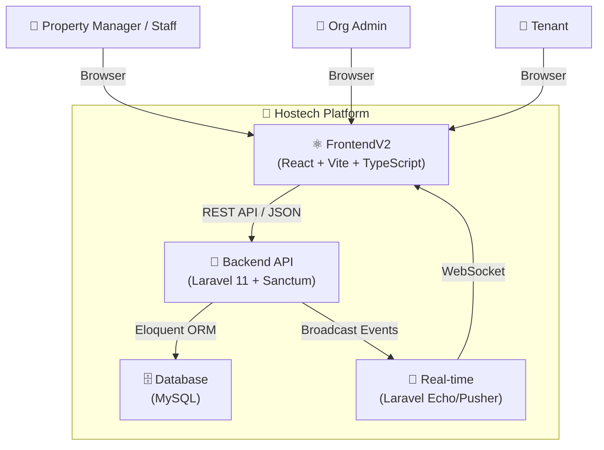
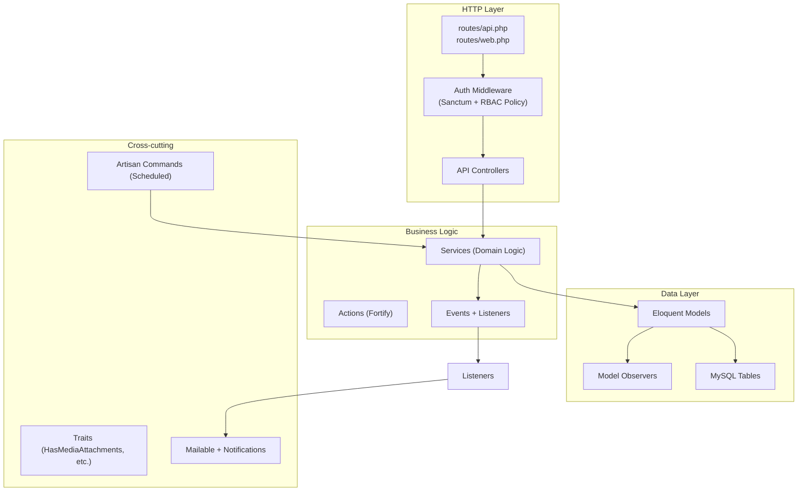
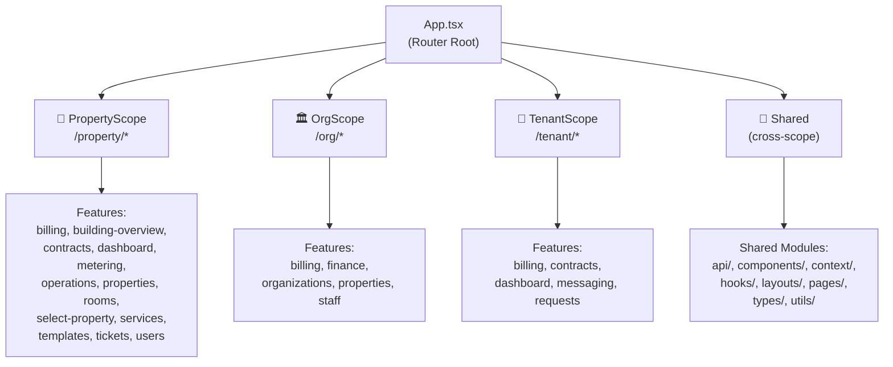
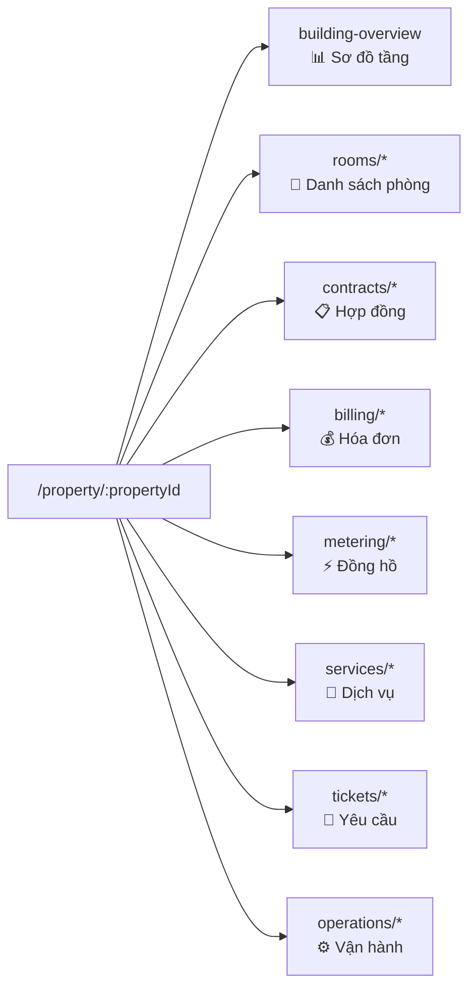
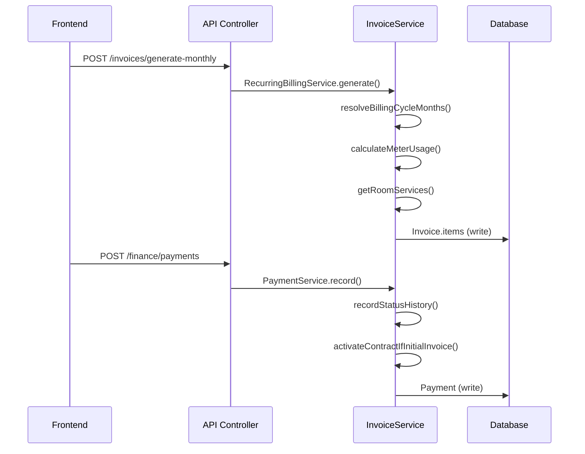
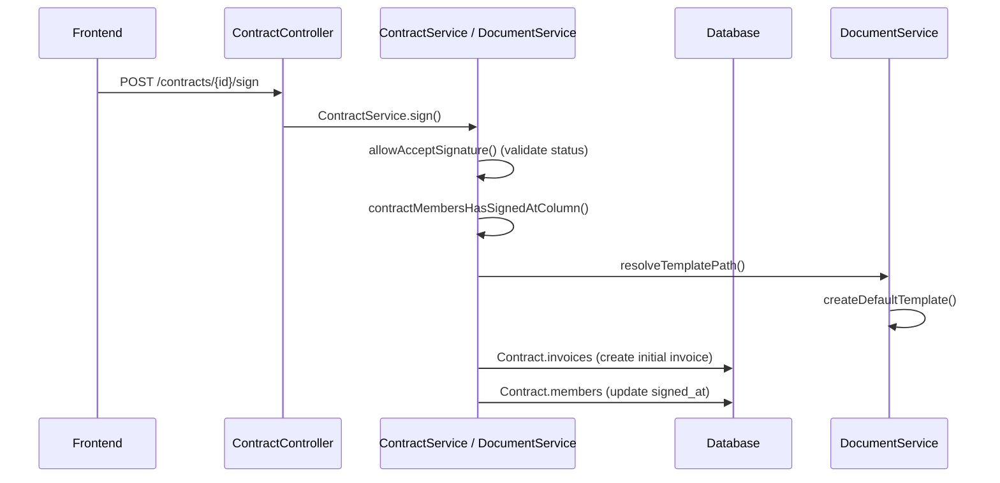
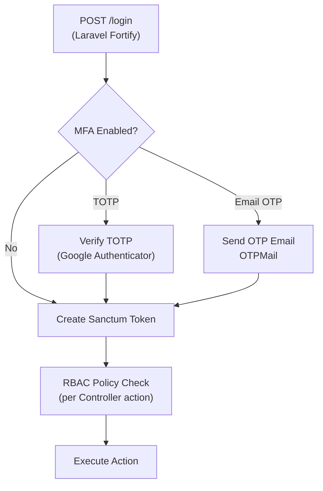
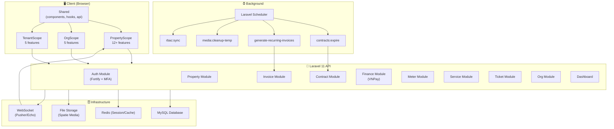

# 🏗️ Phân Tích Kiến Trúc Hệ Thống Hostech

> Được tổng hợp từ **Grapuco MCP Server** — Repository: `HostechBackEnd`

---

## 1. Tổng Quan Hệ Thống

**Hostech** là một nền tảng quản lý bất động sản / cho thuê nhà trọ (Property Management System), hướng đến 3 nhóm người dùng:

| Vai trò | Mô tả |
|---|---|
| **Property Manager / Staff** | Quản lý tòa nhà, phòng, hợp đồng, hóa đơn, đồng hồ |
| **Org Admin** | Quản lý tổ chức, nhân sự, bất động sản cấp tổ chức |
| **Tenant** | Xem hóa đơn, hợp đồng, gửi yêu cầu |

---

## 2. Kiến Trúc Tổng Thể (C4 Level 1 - System Context)



---

## 3. Backend Architecture (Laravel 11)

### 3.1 Layer Stack



### 3.2 Domain Modules (Backend)

| Domain Module | Controllers | Services | Models | Mô tả |
|---|---|---|---|---|
| **Auth** | TwoFactorAuthenticationController | MfaService, UserInvitationService | User | Login, MFA, OTP, Invite |
| **Property** | PropertyController, BuildingOverviewController | PropertyService, RoomService, FloorService | Property, Room, Floor | CRUD tòa nhà, phòng, tầng |
| **Contract** | ContractController, ContractDocumentController | ContractService, ContractDocumentService | Contract, ContractMember | Ký hợp đồng, scan OCR, PDF |
| **Invoice** | InvoiceController, InvoiceAdjustmentController | InvoiceService, RecurringBillingService | Invoice, InvoiceAdjustment, InvoiceItem | Hóa đơn định kỳ, điều chỉnh |
| **Meter** | MeterController, MeterReadingController | MeterReadingService | Meter, MeterReading | Đồng hồ điện/nước |
| **Finance** | PaymentController, VNPayController | PaymentService | Payment | Thanh toán, VNPay IPN |
| **Service** | RoomServiceController | ServiceService | Service, RoomService | Dịch vụ đính kèm phòng |
| **Ticket** | TicketController | TicketService | Ticket | Phiếu yêu cầu bảo trì |
| **Org** | OrgController, UserController | OrgService | Org, User, Role | Tổ chức, nhân viên |
| **Dashboard** | DashboardController | — | — | Thống kê tổng hợp |
| **Handover** | HandoverController | HandoverService | Handover | Bàn giao phòng |
| **Notification** | NotificationController, NotificationRuleController | NotificationService | Notification | Thông báo, rules |
| **System** | UploadController | — | TemporaryUpload | Media upload tạm |

### 3.3 Scheduled Commands (Artisan)

| Command | Mô tả |
|---|---|
| `contracts:expire` | Tự động EXPIRED hợp đồng hết hạn |
| `app:generate-recurring-invoices` | Sinh hóa đơn định kỳ hàng tháng |
| `media:cleanup-temp` | Xóa file upload tạm > 24h |
| `rbac:sync` | Đồng bộ quyền RBAC vào DB |

### 3.4 Real-time Events

| Event | Channel | Trigger |
|---|---|---|
| `MeterReadingStatusChanged` | `private.property.{id}`, `private.user.{id}` | Khi chỉ số đồng hồ được APPROVED |
| `BuildingOverviewUpdated` | — | Khi sync sơ đồ tòa nhà |

---

## 4. Frontend Architecture (React + Vite + TypeScript)

### 4.1 Scope-based Architecture

Frontend được chia theo **3 Scope độc lập**, mỗi scope có layout, routes, features riêng:



### 4.2 Feature Module Structure (Per Feature)

Mỗi feature trong từng Scope tuân theo **Feature-based architecture**:

```
{Scope}/features/{feature}/
├── api/          # axios/fetch calls → backend API
├── components/   # React components của feature
├── hooks/        # Custom hooks (useQuery, useMutation)
├── pages/        # Page-level components (route entry)
├── types/        # TypeScript types/interfaces
└── schema/       # Zod validation schemas (nếu có)
```

### 4.3 PropertyScope Features Chi Tiết

| Feature | Trang chính | Chức năng |
|---|---|---|
| `properties` | `PropertyDetailPage` | Chi tiết bất động sản + tab navigation |
| `building-overview` | `BuildingOverviewPage` | Sơ đồ tòa nhà (drag & drop rooms) |
| `rooms` | `RoomListPage`, `RoomDetailPage` | Danh sách & chi tiết phòng |
| `contracts` | `ContractListPage`, `ContractDetailPage` | Hợp đồng thuê |
| `billing` | `BillingPage` | Hóa đơn & thanh toán |
| `metering` | `MeteringPage` | Quản lý chỉ số đồng hồ |
| `services` | `ServicesPage` | Dịch vụ (điện, nước, wifi...) |
| `tickets` | `TicketsPage` | Phiếu bảo trì |
| `operations` | `OperationsPage` | Vận hành tổng hợp |
| `dashboard` | `DashboardPage` | Thống kê nhanh |
| `users` | `UsersPage` | Quản lý nhân sự tại property |
| `select-property` | `SelectPropertyPage` | Chọn tòa nhà |
| `templates` | `nav.ts`, `routes.tsx` | Template nav & routes |

### 4.4 Navigation Architecture (PropertyScope)



---

## 5. Data Flows (API → Service → DB)

Các luồng dữ liệu quan trọng nhất được phát hiện bởi Grapuco:

### 5.1 Luồng Hóa Đơn & Thanh Toán



### 5.2 Luồng Ký Hợp Đồng



### 5.3 Luồng VNPay IPN

```
POST /finance/vnpay/ipn
  → VNPayController.handleIpn()
  → InvoiceService.recordStatusHistory()
  → InvoiceService.activateContractIfInitialInvoice()
```

### 5.4 Luồng Building Overview Sync

```
POST /properties/{id}/overview/sync
  → BuildingOverviewController.sync()
  → RoomService.quickCreate() (tạo phòng mới)
  → Property.floors (load tầng)
  → Room.assets (load assets)
  → HasMediaAttachments.syncMediaAttachments()
  → Property.defaultServices (gán dịch vụ mặc định)
```

### 5.5 Luồng Tenant (Frontend → Backend)

| Frontend Page | API Calls | Backend Terminal |
|---|---|---|
| `TenantBillingPage` | GET invoices | `Invoice.items`, `Invoice.adjustments` |
| `TenantContractDetailPage` | GET contract detail | `Invoice.items`, `Invoice.adjustments`, `InvoiceAdjustment.isApproved` |
| `TenantBillingPage` | POST payment via VNPay | `InvoiceService.activateContractIfInitialInvoice` |

---

## 6. Authentication & Authorization



**RBAC Flow:**
- `RbacService.sync()` quét tất cả Policies và tạo permissions trong DB
- Mỗi request qua Middleware → kiểm tra `Gate::authorize()`
- Artisan command `rbac:sync` để re-sync sau khi thêm policy mới

---

## 7. Sơ Đồ Kiến Trúc Toàn Cục



---

## 8. Điểm Mạnh Kiến Trúc

| Điểm mạnh | Chi tiết |
|---|---|
| ✅ **Feature-based Frontend** | Mỗi feature độc lập, dễ mở rộng |
| ✅ **3-Scope Separation** | PropertyScope / OrgScope / TenantScope rõ ràng |
| ✅ **Service Layer** | Business logic tách khỏi Controller |
| ✅ **RBAC Policy-based** | Phân quyền tập trung, có thể sync tự động |
| ✅ **Event-driven** | Broadcast real-time cho meter reading |
| ✅ **Scheduled Jobs** | Tự động hóa billing, contract expiry |
| ✅ **Domain-grouped Models** | Models nhóm theo domain (Contract/, Invoice/, Property/) |

## 9. Điểm Cần Cải Thiện / Rủi Ro

| Vấn đề | Mô tả |
|---|---|
| ⚠️ **flowSummary = null** | Grapuco chưa có mô tả ngữ nghĩa cho data flows |
| ⚠️ **Combine UI Designs** | Còn thư mục `Combine UI Designs/` trong repo — có thể là code thừa |
| ⚠️ **TenantScope còn ít** | Chỉ có 5 features, có thể chưa hoàn thiện |
| ⚠️ **No GraphQL** | Toàn bộ REST — có thể bottleneck với màn hình phức tạp nhiều data |
| ⚠️ **VNPay IPN** | Cần bảo vệ endpoint IPN khỏi replay attack |

---

*Phân tích được tổng hợp lúc: 2026-04-07 | Nguồn: Grapuco MCP + Filesystem scan*
