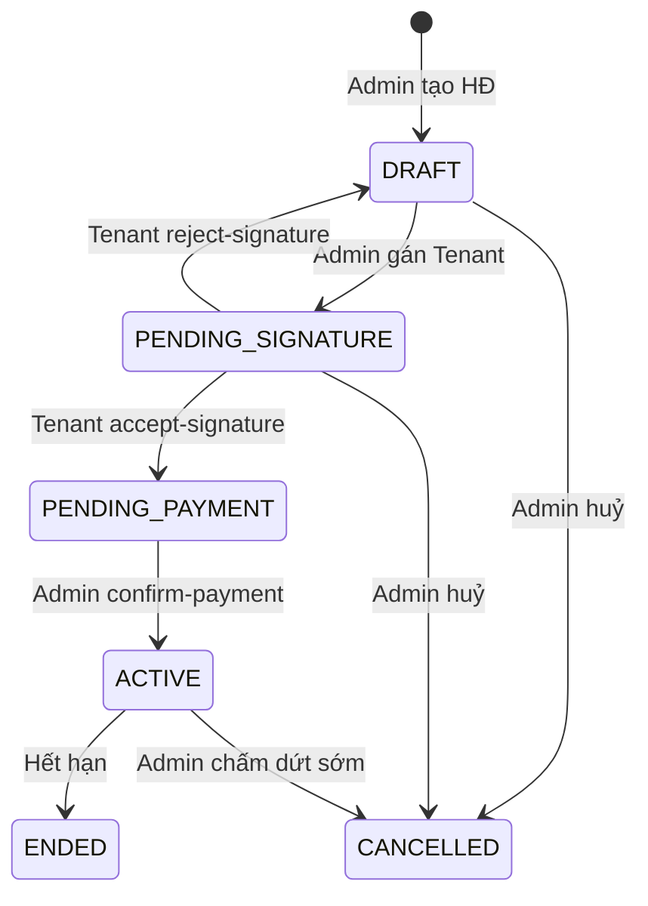
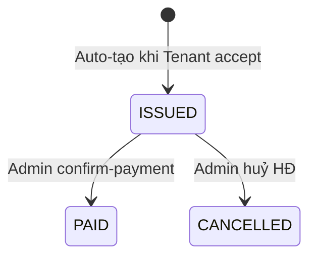

# 🔄 Luồng Ký Hợp Đồng & Tự Động Tạo Hóa Đơn Lần Đầu

> **Feature:** Khi Admin tạo hợp đồng lần đầu (DRAFT) → Tenant xác nhận → Tự động tạo hóa đơn (tiền phòng 1 tháng + tiền cọc) → Tenant thanh toán → Admin xác nhận thanh toán → Hợp đồng ký thành công (ACTIVE).

---

## 1. Phân Tích Hiện Trạng

### 1.1 Luồng hiện tại (❌ Chưa đúng nghiệp vụ)

```
Admin tạo HĐ (DRAFT) + gán Tenant (PENDING member)
        ↓
Tenant gọi acceptSignature()
        ↓
Member → APPROVED, Contract → ACTIVE  ← 🔴 Bỏ qua bước thanh toán!
```

**Vấn đề:**
- `acceptSignature()` hiện tại chuyển Contract thẳng từ `DRAFT` → `ACTIVE` → **không có bước tạo hóa đơn**, **không có bước thanh toán**.
- Không có trạng thái trung gian `PENDING_PAYMENT` cho Contract.
- Invoice không có kiểu đánh dấu "hóa đơn ban đầu" (initial invoice).
- Không có logic auto-generate invoice khi Tenant confirm.

### 1.2 Các giá trị Status hiện tại

| Entity | Các trạng thái hiện tại |
|---|---|
| **Contract** | `DRAFT`, `ACTIVE`, `ENDED`, `CANCELLED` |
| **ContractMember** | `PENDING`, `APPROVED`, `REJECTED` |
| **Invoice** | `DRAFT`, `ISSUED`, `PENDING`, `PAID`, `OVERDUE`, `CANCELLED` |

> **Lưu ý:** `PENDING_SIGNATURE` đã được nhắc đến trong `DORMANT_TENANT_PLAN.md` và code `acceptSignature()` đã check `PENDING_SIGNATURE`, nhưng chưa thêm vào migration/validation.

---

## 2. Luồng Mới (✅ Đề xuất)

### 2.1 Sơ đồ tổng quan

```
                    ┌─────────────┐
                    │  ADMIN tạo  │
                    │ hợp đồng    │
                    │  (DRAFT)    │
                    └──────┬──────┘
                           │ Admin gán Tenant (member PENDING)
                           │ Contract → PENDING_SIGNATURE
                           ▼
                    ┌─────────────────┐
                    │  TENANT thấy    │
                    │  HĐ chờ ký      │
                    │ (my-pending)     │
                    └──────┬──────────┘
                           │ Tenant gọi accept-signature
                           ▼
               ┌───────────────────────────┐
               │  HỆ THỐNG tự động:        │
               │  1. Member → APPROVED     │
               │  2. Tạo Initial Invoice   │
               │     - Tiền phòng 1 tháng  │
               │     - Tiền cọc            │
               │  3. Issue Invoice (ISSUED) │
               │  4. Contract →            │
               │     PENDING_PAYMENT       │
               └───────────┬───────────────┘
                           │
                           ▼
               ┌───────────────────────────┐
               │  TENANT thanh toán        │
               │  (online/chuyển khoản)    │
               └───────────┬───────────────┘
                           │
                           ▼
               ┌───────────────────────────┐
               │  ADMIN xác nhận           │
               │  thanh toán (confirm-pay) │
               │                           │
               │  1. Invoice → PAID        │
               │  2. Contract → ACTIVE     │
               │  3. signed_at = now()     │
               │  4. Room → OCCUPIED       │
               └───────────────────────────┘
```

### 2.2 State Machine - Contract



### 2.3 State Machine - Invoice (Initial Invoice)



---

## 3. Chi Tiết Thay Đổi

### 3.1 Database Changes

#### A. Bổ sung trạng thái Contract
Thêm 2 trạng thái mới vào `contracts.status`:

```
Cũ:  DRAFT | ACTIVE | ENDED | CANCELLED
Mới: DRAFT | PENDING_SIGNATURE | PENDING_PAYMENT | ACTIVE | ENDED | CANCELLED
```

**Migration mới:**
```php
// Không cần migration (status là VARCHAR, không phải ENUM)
// Chỉ cần cập nhật validation rules
```

#### B. Đánh dấu hóa đơn ban đầu (Initial Invoice)
**Phương án:** Sử dụng trường `snapshot` (JSON, đã có sẵn) để đánh dấu:

```json
{
  "is_initial": true,
  "contract_signing": true
}
```

**Lý do chọn `snapshot`:** Trường đã tồn tại, dùng để lưu metadata bất biến. Không cần thêm cột mới.

**Phương án thay thế** (nếu muốn tường minh hơn): Tạo migration thêm cột:
```php
$table->boolean('is_initial')->default(false)->after('snapshot');
```

> ⚠️ **Cần review:** Bạn prefer dùng `snapshot` JSON hay thêm cột `is_initial`?

---

### 3.2 Backend Changes

#### A. Files cần SỬA (modify)

| # | File | Thay đổi |
|---|---|---|
| 1 | `ContractStoreRequest.php` | Thêm `PENDING_SIGNATURE`, `PENDING_PAYMENT` vào validation rule `status` |
| 2 | `ContractUpdateRequest.php` | Thêm `PENDING_SIGNATURE`, `PENDING_PAYMENT` vào validation rule `status` |
| 3 | `ContractService.php` → `create()` | Khi tạo HĐ có members → auto chuyển status sang `PENDING_SIGNATURE` |
| 4 | `ContractService.php` → `acceptSignature()` | **Sửa lớn:** Thay vì ACTIVE, chuyển → `PENDING_PAYMENT` + gọi tạo Initial Invoice |
| 5 | `InvoiceService.php` | Thêm method `createInitialInvoice()` |
| 6 | `InvoiceController.php` → `pay()` | Sau khi PAID, kiểm tra nếu là initial invoice → active Contract |
| 7 | Frontend `ContractStatus` types | Thêm `PENDING_SIGNATURE`, `PENDING_PAYMENT` |
| 8 | Frontend `InvoiceStatus` labels | (Nếu cần thêm label cho initial invoice) |

#### B. Files cần TẠO MỚI (nếu cần)

Không cần tạo file mới. Tất cả logic nằm trong các file hiện có.

---

### 3.3 Chi Tiết Logic Từng Bước

#### Bước 1: Admin tạo hợp đồng (HIỆN CÓ, cần SỬA nhẹ)

**File:** `ContractService.php` → `create()`

```php
// Hiện tại: Contract tạo xong với status = DRAFT
// Sửa: Nếu có members → tự chuyển status thành PENDING_SIGNATURE

public function create(array $data, ?User $user = null): Contract
{
    return DB::transaction(function () use ($data, $user) {
        // ... (giữ nguyên logic cũ) ...

        $contract = Contract::create($contractData);

        if (isset($data['members']) && is_array($data['members'])) {
            foreach ($data['members'] as $memberData) {
                // ✅ Giữ nguyên: member PENDING khi có user_id (Tenant chờ ký)
                $this->addMember($contract, array_merge($memberData, [
                    'status' => $memberData['user_id'] ? 'PENDING' : 'APPROVED',
                ]), $user);
            }

            // ✅ MỚI: Nếu có member với user_id → chuyển sang PENDING_SIGNATURE
            $hasPendingTenant = collect($data['members'])
                ->contains(fn($m) => !empty($m['user_id']));
            if ($hasPendingTenant) {
                $contract->update(['status' => 'PENDING_SIGNATURE']);
            }
        }

        return $contract;
    });
}
```

#### Bước 2: Tenant xác nhận ký (CẦN SỬA LỚN)

**File:** `ContractService.php` → `acceptSignature()`

```php
public function acceptSignature(Contract $contract, User $user): bool
{
    $member = ContractMember::where('contract_id', $contract->id)
        ->where('user_id', $user->id)
        ->where('status', 'PENDING')
        ->first();

    if (! $member) {
        return false;
    }

    return DB::transaction(function () use ($contract, $member, $user) {
        // 1. Approve member
        $member->update([
            'status' => 'APPROVED',
            'joined_at' => now(),
        ]);

        // 2. Tạo Initial Invoice (tiền phòng + tiền cọc)
        $invoice = $this->createInitialInvoice($contract, $user);

        // 3. Chuyển Contract → PENDING_PAYMENT (thay vì ACTIVE)
        if (in_array($contract->status, ['DRAFT', 'PENDING_SIGNATURE'])) {
            $contract->update([
                'status' => 'PENDING_PAYMENT',
            ]);
        }

        return true;
    });
}
```

#### Bước 3: Tạo Initial Invoice (LOGIC MỚI)

**File:** `ContractService.php` (hoặc `InvoiceService.php`)

```php
/**
 * Tạo hóa đơn ban đầu khi Tenant xác nhận hợp đồng.
 * Gồm: Tiền phòng tháng đầu + Tiền đặt cọc.
 */
private function createInitialInvoice(Contract $contract, User $tenant): Invoice
{
    $now = now();
    $periodStart = $contract->start_date;
    $periodEnd = $contract->start_date->copy()->addMonth()->subDay();
    $dueDate = $now->copy()->addDays(3); // Hạn thanh toán: 3 ngày

    // Tính tổng
    $rentAmount = (float) $contract->rent_price;
    $depositAmount = (float) $contract->deposit_amount;
    $totalAmount = $rentAmount + $depositAmount;

    // Items
    $items = [
        [
            'type' => 'RENT',
            'description' => 'Tiền phòng tháng đầu tiên',
            'quantity' => 1,
            'unit_price' => $rentAmount,
            'amount' => $rentAmount,
        ],
    ];

    if ($depositAmount > 0) {
        $items[] = [
            'type' => 'DEPOSIT',  // ⚠️ Cần thêm type DEPOSIT
            'description' => 'Tiền đặt cọc',
            'quantity' => 1,
            'unit_price' => $depositAmount,
            'amount' => $depositAmount,
        ];
    }

    // Tạo Invoice qua InvoiceService
    $invoiceService = app(InvoiceService::class);

    return $invoiceService->createAndIssueInitialInvoice([
        'org_id' => $contract->org_id,
        'property_id' => $contract->property_id,
        'contract_id' => $contract->id,
        'room_id' => $contract->room_id,
        'period_start' => $periodStart->format('Y-m-d'),
        'period_end' => $periodEnd->format('Y-m-d'),
        'due_date' => $dueDate->format('Y-m-d'),
        'status' => 'ISSUED',
        'snapshot' => ['is_initial' => true],
        'created_by_user_id' => $tenant->id,
    ], $items);
}
```

#### Bước 4: Admin xác nhận thanh toán → Activate Contract (CẦN SỬA)

**File:** `InvoiceService.php` → `payInvoice()` hoặc tạo method riêng

```php
/**
 * Thanh toán hóa đơn.
 * Nếu là Initial Invoice → kích hoạt hợp đồng.
 */
public function payInvoice(Invoice $invoice, ?string $note = null): Invoice
{
    return DB::transaction(function () use ($invoice, $note) {
        $oldStatus = $invoice->status;

        $invoice->update([
            'status' => 'PAID',
            'paid_amount' => $invoice->total_amount,
        ]);

        $this->recordStatusHistory($invoice, $oldStatus, 'PAID', $note);

        // ✅ MỚI: Nếu là Initial Invoice → Activate Contract
        $this->activateContractIfInitialInvoice($invoice);

        return $invoice->refresh();
    });
}

/**
 * Hook: Kích hoạt hợp đồng khi Initial Invoice được thanh toán.
 */
private function activateContractIfInitialInvoice(Invoice $invoice): void
{
    $snapshot = $invoice->snapshot;

    if (
        is_array($snapshot)
        && ($snapshot['is_initial'] ?? false) === true
        && $invoice->contract
        && $invoice->contract->status === 'PENDING_PAYMENT'
    ) {
        $invoice->contract->update([
            'status' => 'ACTIVE',
            'signed_at' => now(),
        ]);
    }
}
```

---

## 4. InvoiceItem Type - Xử lý "Tiền cọc"

### Vấn đề
Hiện tại `invoice_items.type` chỉ hỗ trợ: `RENT`, `SERVICE`, `PENALTY`, `DISCOUNT`, `ADJUSTMENT`.

→ **Thiếu `DEPOSIT`** (tiền cọc).

### Giải pháp
Thêm `DEPOSIT` vào danh sách type cho `invoice_items`.

**Files cần sửa:**

| File | Thay đổi |
|---|---|
| `InvoiceStoreRequest.php` | `'in:RENT,SERVICE,PENALTY,DISCOUNT,ADJUSTMENT'` → thêm `DEPOSIT` |
| `InvoiceController.php` → `storeItem()` | Cập nhật validation inline → thêm `DEPOSIT` |
| Frontend `types/index.ts` | Thêm type `DEPOSIT` |

---

## 5. Tóm Tắt Tất Cả Thay Đổi

### 5.1 Backend

| # | File | Loại | Mô tả |
|---|---|---|---|
| 1 | `ContractStoreRequest.php` | **Sửa** | Thêm `PENDING_SIGNATURE`, `PENDING_PAYMENT` vào validation |
| 2 | `ContractUpdateRequest.php` | **Sửa** | Thêm `PENDING_SIGNATURE`, `PENDING_PAYMENT` vào validation |
| 3 | `ContractService::create()` | **Sửa** | Auto-set `PENDING_SIGNATURE` khi có member pending |
| 4 | `ContractService::acceptSignature()` | **Sửa lớn** | Tạo Initial Invoice + chuyển `PENDING_PAYMENT` (thay vì ACTIVE) |
| 5 | `ContractService` | **Thêm method** | `createInitialInvoice()` |
| 6 | `InvoiceService::payInvoice()` | **Sửa** | Thêm hook `activateContractIfInitialInvoice()` |
| 7 | `InvoiceService` | **Thêm method** | `createAndIssueInitialInvoice()`, `activateContractIfInitialInvoice()` |
| 8 | `InvoiceStoreRequest.php` | **Sửa** | Thêm type `DEPOSIT` |
| 9 | `InvoiceController::storeItem()` | **Sửa** | Thêm type `DEPOSIT` vào validation |

### 5.2 Frontend

| # | File | Loại | Mô tả |
|---|---|---|---|
| 1 | `contracts/types/index.ts` | **Sửa** | Thêm `PENDING_SIGNATURE`, `PENDING_PAYMENT` + labels + colors |
| 2 | `invoices/types/index.ts` | **Sửa** | Thêm item type `DEPOSIT` |
| 3 | `contracts/pages/Detail.tsx` | **Sửa** | Hiển thị trạng thái mới + link tới Initial Invoice |
| 4 | `invoices/pages/Detail.tsx` | **Sửa** | Đánh dấu UI nếu là Initial Invoice |

---

## 6. Câu Hỏi Cần Review

> [!IMPORTANT]
> Trước khi bắt tay code, xin xác nhận các điểm sau:

### Q1: Hạn thanh toán hóa đơn ban đầu
Nên đặt bao lâu kể từ khi Tenant confirm? Mình tạm đề xuất **3 ngày**. Bạn muốn thay đổi không?

### Q2: Cách đánh dấu "Initial Invoice"
- **Phương án A:** Dùng trường `snapshot` JSON có sẵn → `{"is_initial": true}` (không cần migration)
- **Phương án B:** Thêm cột `is_initial` BOOLEAN vào bảng `invoices` (cần migration, tường minh hơn)

**Đề xuất:** Phương án A (đơn giản, không phá schema).

### Q3: Type "DEPOSIT" cho InvoiceItem
Cần thêm `DEPOSIT` vào enum type? Hay dùng `ADJUSTMENT` type kèm description "Tiền cọc"?

**Đề xuất:** Thêm type `DEPOSIT` riêng cho tường minh.

### Q4: Khi Admin huỷ HĐ ở trạng thái PENDING_PAYMENT
Initial Invoice đã tạo sẽ bị **auto-cancel** hay **để nguyên (manual cancel)**?

**Đề xuất:** Auto-cancel invoice khi cancel contract ở `PENDING_PAYMENT`.

### Q5: Reject Signature
Khi Tenant reject ở bước PENDING_SIGNATURE, contract nên quay lại `DRAFT` hay chuyển `CANCELLED`?

**Đề xuất:** Quay lại `DRAFT` (Admin có thể gán Tenant khác).

### Q6: Room status
Khi Contract chuyển ACTIVE, cần cập nhật `rooms.status` → `OCCUPIED` không?

---

## 7. Thứ Tự Triển Khai (Đề xuất)

```
Phase 1: Backend Core Logic
  ├── 1.1 Cập nhật validation rules (Contract status + Invoice item type)
  ├── 1.2 Sửa ContractService::create() → auto PENDING_SIGNATURE
  ├── 1.3 Sửa ContractService::acceptSignature() → tạo Initial Invoice + PENDING_PAYMENT
  ├── 1.4 Thêm InvoiceService::createAndIssueInitialInvoice()
  └── 1.5 Sửa InvoiceService::payInvoice() → hook activateContract

Phase 2: Frontend Updates
  ├── 2.1 Cập nhật types (ContractStatus + InvoiceItemType)
  ├── 2.2 Cập nhật Contract Detail page
  └── 2.3 Cập nhật Invoice Detail page

Phase 3: Edge Cases & Polish
  ├── 3.1 Cancel contract → auto-cancel initial invoice
  ├── 3.2 Room status sync
  └── 3.3 Testing
```
