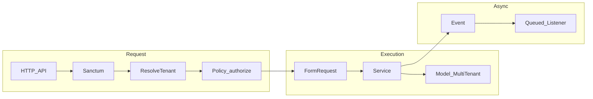
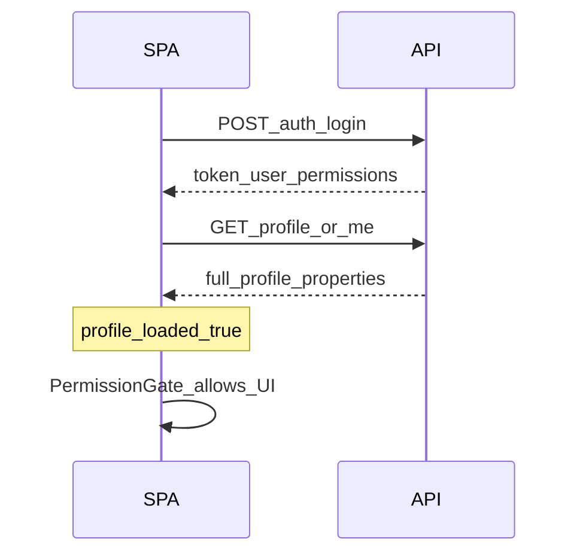
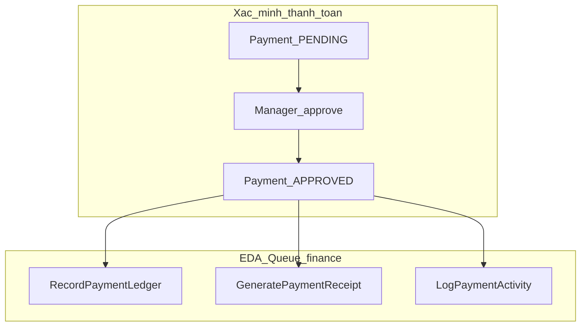

# Báo cáo quét toàn bộ: SaaS multi-tenant Hostech

**Phạm vi:** monorepo `backend/` (Laravel 12), `frontendV2Hostech/` (React + Vite + TypeScript), tài liệu `backend/docs/`, `DEPLOY.md`, `README.md` gốc.  
**Ngày tham chiếu mã nguồn:** tháng 4/2026.

---

## 1. Tóm tắt tính năng hiện có và mức độ hoàn thiện tổng thể

### 1.1 Các nhóm tính năng (theo API route modules)

| Nhóm                     | Mô tả ngắn                                                         | Route backend (gợi ý)                                                                                      |
| ------------------------ | ------------------------------------------------------------------ | ---------------------------------------------------------------------------------------------------------- |
| **Auth & hồ sơ**         | Fortify + Sanctum JSON login, MFA, `/api/auth/me`, profile, logout | `[routes/api/auth.php](../../routes/api/auth.php)`, Fortify config                                         |
| **Tổ chức & người dùng** | Org CRUD (Owner), users, invitations                               | `[org.php](../../routes/api/org.php)`, `[system` public invitations trong `api.php](../../routes/api.php)` |
| **Bất động sản**         | Properties, floors, rooms, room assets, upload media               | `[property.php](../../routes/api/property.php)`, `[system.php](../../routes/api/system.php)`               |
| **Dịch vụ**              | Dịch vụ đo/charge theo org                                         | `[service.php](../../routes/api/service.php)`                                                              |
| **Hợp đồng**             | Hợp đồng, thành viên, tài liệu, chấm dứt / luồng ký                | `[contract.php](../../routes/api/contract.php)`                                                            |
| **Hóa đơn & billing**    | Invoice, expenses, điều chỉnh, quick invoice                       | `[invoice.php](../../routes/api/invoice.php)`                                                              |
| **Tài chính**            | Payments, ledger, cashflow, VNPay, duyệt bằng chứng tenant         | `[finance.php](../../routes/api/finance.php)`                                                              |
| **Đồng hồ**              | Meter, readings, bulk, tenant chỉ xem / gửi chỉ số (portal)        | `[meter.php](../../routes/api/meter.php)`, `[tenant.php](../../routes/api/tenant.php)`                     |
| **Bàn giao**             | Handover workflows                                                 | `[handover.php](../../routes/api/handover.php)`                                                            |
| **Ticket**               | Yêu cầu / ticket theo property                                     | `[ticket.php](../../routes/api/ticket.php)`                                                                |
| **Thông báo**            | Templates, rules, notifications                                    | `[notification.php](../../routes/api/notification.php)`                                                    |
| **Dashboard**            | Thống kê tổng hợp                                                  | `[dashboard.php](../../routes/api/dashboard.php)`                                                          |
| **Tenant portal**        | Building overview, meters (read), nộp bằng chứng thanh toán        | `[tenant.php](../../routes/api/tenant.php)` prefix `/api/app/...`                                          |

### 1.2 Giao diện SPA (React)

- **Admin / Owner:** layout org (`/org/`*), dashboard tổ chức.
- **Manager / Staff:** chọn cơ sở → scope property (`/properties/:propertyId/`*) — property switcher, billing, finance, contracts, metering, tickets, users, v.v.
- **Tenant:** portal `/app/`* (dashboard, billing, contracts, building overview, rooms, messaging, requests).

### 1.3 Đánh giá mức độ hoàn thiện tổng thể (định tính)

| Tiêu chí                                                            | Trạng thái           | Ghi chú                                                                                                                                                                                                                |
| ------------------------------------------------------------------- | -------------------- | ---------------------------------------------------------------------------------------------------------------------------------------------------------------------------------------------------------------------- |
| **Nghiệp vụ lõi** (org, property, room, contract, invoice, payment) | **Cao**              | Có module docs đánh dấu hoàn thành (`[docs/modules/README.md](../modules/README.md)`), policy + service tách bạch, luồng EDA tài chính (listeners trong `app/Listeners/Finance/`).                                     |
| **Vận hành & chất lượng**                                           | **Trung bình → cao** | CI: test, Pint, PHPStan, audit dependency (`[.github/workflows/ci.yml](../../../.github/workflows/ci.yml)`); runbook `[DEPLOY.md](../../../DEPLOY.md)`; tài liệu backup/RBAC/observability trong `docs/architecture/`. |
| **Tài liệu vs mã**                                                  | **Trung bình**       | Một số mục index module vẫn ghi Ticket/Handover “chưa triển khai” trong khi **đã có** route + policy — lệch pha tài liệu (xem mục 4).                                                                                  |
| **Đồng bộ FE–BE hợp đồng**                                          | **Trung bình**       | Auth/profile có baseline chính thức; `PERMISSIONS` tập trung hóa string; vẫn còn chỗ dùng string thủ công / `api.json` cần đồng bộ định kỳ.                                                                            |
| **Tenant experience**                                               | **Trung bình**       | Portal đủ luồng chính; một số trang placeholder (ví dụ “Tin tức” trong tenant routes).                                                                                                                                 |

**Kết luận ngắn:** Sản phẩm ở mức **MVP+ / gần production** cho quản lý nhà trọ đa tenant: nghiệp vụ và RBAC rõ ràng, SPA hiện đại; điểm cần cải thiện chủ yếu là **thống nhất tài liệu**, **đóng kín drift permission/OpenAPI**, và hoàn thiện các màn hình tenant phụ.

---

## 2. Logic nghiệp vụ và luồng chức năng

### 2.1 Multi-tenant & request lifecycle

1. Request vào API → Sanctum xác thực (Bearer).
2. `[ResolveTenant](../../app/Http/Middleware/ResolveTenant.php)`: gán `org_id` (từ user nếu không phải Admin; Admin có thể dùng header/query) và `property_id` từ header/query.
3. Model dùng trait `[MultiTenant](../../app/Models/Concerns/MultiTenant.php)`: global scope theo `TenantManager::getOrgId()`; tự gán `org_id` khi tạo.
4. Controller mỏng → **Service** xử lý → **Resource** trả JSON; sự kiện domain → **Listener** (queue `finance`, v.v.).

### 2.2 Luồng đăng nhập & RBAC trên SPA

1. `POST /api/auth/login` → token + `user.permissions` (và `role`, `roles`, `org_id`, …) theo `[api_auth_contract_baseline.md](./api_auth_contract_baseline.md)`.
2. Sau login, SPA thường gọi thêm profile (`GET /api/profile` hoặc tương đương trong bootstrap) để gán `profile_loaded` — `[PermissionGate](../../../frontendV2Hostech/src/shared/features/auth/components/PermissionGate.tsx)` **chặn** UI theo permission cho đến khi `profile_loaded === true`.
3. `[RootRedirect](../../../frontendV2Hostech/src/routes/index.tsx)`: điều hướng theo `user.role` (Admin/Owner → `/org/dashboard`, Manager/Staff → property hoặc `/select-property`, Tenant → `/app/dashboard`).

### 2.3 Luồng tài chính (payment → hóa đơn → sổ cái)

- Tạo / duyệt payment (tiền mặt, chuyển khoản, VNPay…) qua `[PaymentService](../../app/Services/Finance/PaymentService.php)` và controller tài chính.
- Khi payment **APPROVED**, observer phát `[PaymentSuccessfullyVerified](../../app/Events/Finance/PaymentSuccessfullyVerified.php)`.
- Listeners (queue `finance`): ghi ledger, tạo receipt PDF, log activity, broadcast, thông báo tenant (xem `AppServiceProvider` đăng ký event).
- Tenant portal: `POST /api/app/payments/submit-proof` (throttle) → Manager duyệt qua `payment-verifications`.

### 2.4 Luồng hợp đồng & hóa đơn (rút gọn)

- Owner/Manager tạo hợp đồng, gắn `ContractMember` (tenant pending/approved).
- Tenant chấp nhận / ký (endpoint theo module contract — xem tài liệu `[04_contract.md](../modules/04_contract.md)`).
- Phát hành hóa đơn (DRAFT → ISSUED), điều chỉnh, thanh toán bù trừ `paid_amount` — tích hợp với payment allocations.

### 2.5 Luồng đồng hồ (meter)

- BQL tạo meter / readings; duyệt reading kích hoạt tổng hợp master (EDA — xem `system_flows.md`).
- Tenant: chỉ đọc meter của phòng (`/api/app/meters`) và có thể tạo reading theo policy `MeterReadingPolicy` (Staff CR, Tenant CR theo bảng sync).

---

## 3. Đánh giá tích hợp React SPA ↔ Laravel API

### 3.1 Điểm khớp tốt (đồng bộ)

| Chủ đề                 | Chi tiết                                                                                                                                                                                                 |
| ---------------------- | -------------------------------------------------------------------------------------------------------------------------------------------------------------------------------------------------------- |
| **Auth JSON**          | `LoginResponse` / `TwoFactorLoginResponse` / `UserResource` thống nhất field `role`, `roles`, `permissions` (`[api_auth_contract_baseline.md](./api_auth_contract_baseline.md)`).                        |
| **Permission strings** | FE dùng `[permissions.ts](../../../frontendV2Hostech/src/shared/features/auth/permissions.ts)` trùng format `{action} {ModuleName}` với `RbacService`.                                                   |
| **Scope header**       | FE `[client.ts](../../../frontendV2Hostech/src/shared/api/client.ts)` gửi `X-Org-Id` / `X-Property-Id` theo path; BE `[ResolveTenant](../../app/Http/Middleware/ResolveTenant.php)` đọc cùng tên header. |
| **Request ID**         | FE tạo `X-Request-Id`; BE `[AssignRequestId](../../app/Http/Middleware/AssignRequestId.php)` chấp nhận hoặc tự sinh.                                                                                     |

### 3.2 Lệch pha / rủi ro đồng bộ (cần ghi nhận chính xác)

| #   | Loại                           | Mô tả                                                                                                                                                                                                                            | Hậu quả                                                                                                                                           | Gợi ý                                                             |
| --- | ------------------------------ | -------------------------------------------------------------------------------------------------------------------------------------------------------------------------------------------------------------------------------- | ------------------------------------------------------------------------------------------------------------------------------------------------- | ----------------------------------------------------------------- |
| L1  | **Tài liệu repo**              | `[README.md](../../../README.md)` gốc vẫn nói thư mục `frontend/` trong khi SPA thực tế là `**frontendV2Hostech/`**.                                                                                                             | Onboarding sai đường dẫn.                                                                                                                         | Sửa README hoặc thêm symlink/redirect trong doc.                  |
| L2  | **Tài liệu module index**      | `[docs/modules/README.md](../modules/README.md)` ghi **09_handover / 10_ticket “chưa triển khai”** nhưng đã có `[handover.php](../../routes/api/handover.php)`, `[ticket.php](../../routes/api/ticket.php)` và Policy tương ứng. | PM/dev hiểu sai mức độ sẵn sàng module.                                                                                                           | Cập nhật bảng trạng thái hoặc ghi “đã có API, doc chi tiết ở …”.  |
| L3  | **Phiên bản / branding FE**    | `[frontendV2Hostech/README.md](../../../frontendV2Hostech/README.md)` nói React 18; `package.json` có thể dùng React 19.x.                                                                                                       | Tài liệu marketing kỹ thuật lệch.                                                                                                                 | Đồng bộ README với `package.json`.                                |
| L4  | **OpenAPI ↔ TypeScript**       | Script `npm run type-sync` sinh type từ `[backend/api.json](../../api.json)`; không phải mọi hook FE đều import type generated.                                                                                                  | Một số endpoint/shape vẫn “tự khai báo”, dễ lệch khi API đổi.                                                                                     | Rà soát các file `*Api.ts` / hooks không dùng `api.generated.ts`. |
| L5  | **Header scope cho Tenant**    | Interceptor chỉ gắn `X-Property-Id` khi path khớp `/properties/:uuid`. Tenant thường ở `/app/`* — **không** gửi property header từ URL.                                                                                          | Hợp lệ nếu backend chỉ cần `org_id` + auth để suy luận phòng; nếu có endpoint manager-style đòi `X-Property-Id`, tenant có thể lỗi thiếu context. | Kiểm tra từng endpoint tenant-only; bổ sung scope store nếu cần.  |
| L6  | **Permission literal rải rác** | Ví dụ `[ContractDetailPage](../../../frontendV2Hostech/src/PropertyScope/features/contracts/pages/ContractDetailPage.tsx)` dùng `hasPermission('update Contracts')` thay vì `PERMISSIONS.updateContracts`.                       | Khó refactor; dễ typo.                                                                                                                            | Dần thay bằng `PERMISSIONS.`*.                                    |
| L7  | **Tập PERMISSIONS.ts**         | Không liệt kê hết mọi quyền (ví dụ Floor, Meter, Services, Users, Orgs…) — UI có thể dựa role-only `PermissionGate` thay vì permission fine-grained.                                                                             | UI có thể hiện nút mà API vẫn 403 (hoặc ngược lại ẩn quá mức).                                                                                    | Mở rộng `PERMISSIONS` + audit từng màn hình.                      |
| L8  | **Placeholder UI**             | Tenant route `news` là trang static “đang phát triển”.                                                                                                                                                                           | Không lệch API nhưng lệch kỳ vọng sản phẩm.                                                                                                       | Ẩn menu hoặc nối API thật.                                        |

---

## 4. Ma trận RBAC toàn diện

### 4.1 Quy ước

- **Chuỗi permission chuẩn:** `{action} {ModuleName}` với `action` ∈ `viewAny`, `view`, `create`, `update`, `updateAny`, `delete`, … (`[RbacAction](../../app/Enums/RbacAction.php)`).
- **Shorthand trong policy** (sync bởi `[RbacService](../../app/Services/RbacService.php)`):
  - `C` → `create`
  - `R` → `viewAny` + `view`
  - `U` → `update` + `updateAny`
  - `D` → toàn bộ nhóm delete/restore/forceDelete…
  - `-` → không gán quyền module đó qua sync
- `**Admin` (system admin):** không xuất hiện trong `getRolePermissions()`; mọi policy trả về **cho phép** qua `Gate::before` khi `hasRole('Admin')` (`[AuthServiceProvider](../../app/Providers/AuthServiceProvider.php)`).

### 4.2 Bảng tổng hợp theo module (sync từ Policy)

Cột **Shorthand** = giá trị trong `getRolePermissions()`. Cột **Quyền Spatie được sync (tóm tắt)** = kết quả giải mã shorthand (không liệt kê từng biến thể `deleteAny` nếu trùng nhóm `D`).

| Module (`getModuleName`) | Owner | Manager | Staff | Tenant   | Ghi chú runtime quan trọng                                                                                                   |
| ------------------------ | ----- | ------- | ----- | -------- | ---------------------------------------------------------------------------------------------------------------------------- |
| **Orgs**                 | CRUD  | -       | -     | -        | Admin bypass; Owner quản lý org.                                                                                             |
| **Users**                | CRUD  | CRUD    | R     | -        |                                                                                                                              |
| **Properties**           | CRUD  | RU      | R     | R        | Tenant **view** chỉ khi có hợp đồng ACTIVE/PENDING thanh toán + member approved (policy).                                    |
| **Floor**                | CRUD  | CRUD    | R     | -        |                                                                                                                              |
| **Room**                 | CRUD  | CRUD    | RU    | R        | Tenant theo phòng/hợp đồng (policy).                                                                                         |
| **RoomAsset**            | CRUD  | CRUD    | R     | R        |                                                                                                                              |
| **Services**             | CRUD  | CRUD    | R     | R        |                                                                                                                              |
| **Contracts**            | CRUD  | CRUD    | R     | R        | Tenant **view** theo membership hợp đồng, không chỉ từ chữ `R`.                                                              |
| **Invoice**              | CRUD  | CRUD    | R     | R        | Tenant chỉ invoice của hợp đồng mình.                                                                                        |
| **Payment**              | CRUD  | CRUD    | R     | R        | Tenant **view** payment có `payer_user_id` = mình; **create** self-service (policy). `viewLedger` map tới `viewAny Payment`. |
| **Meter**                | CRUD  | CRUD    | R     | -        | Tenant dùng route `/api/app/...` cho meter read.                                                                             |
| **MeterReading**         | CRUD  | CRUD    | CR    | CR       | Staff tạo chỉ số chốt; Tenant tạo/gửi chỉ số (portal) theo policy chi tiết.                                                  |
| **Ticket**               | CRUD  | CRUD    | RU    | CR       | Tenant tạo/xem ticket của mình.                                                                                              |
| **Handover**             | CRUD  | CRUD    | CRUD  | - (sync) | Tenant có thể **view** handover đã CONFIRMED liên quan hợp đồng (`HandoverPolicy`) dù shorthand `-`.                         |
| **UserInvitations**      | CRUD  | CR      | -     | -        |                                                                                                                              |
| **AuditLog**             | R     | -       | -     | -        |                                                                                                                              |

### 4.3 Admin (system admin)

| Vai trò   | Quyền hiệu dụng                                                                                                                                                          |
| --------- | ------------------------------------------------------------------------------------------------------------------------------------------------------------------------ |
| **Admin** | **Toàn bộ** ability trên mọi model gắn policy (và các gate policy khác) nhờ `Gate::before` — không phụ thuộc bảng permission trừ khi code kiểm tra trực tiếp ngoài Gate. |

### 4.4 Liệt kê permission Spatie theo vai trò (sau `rbac:sync`)

Dưới đây là **tập permission name** mà mỗi role **nhận được từ sync** (từ shorthand). Các quyền “đặc biệt” chỉ có trong policy (ví dụ Tenant xem handover) **không** có trong danh sách này nếu shorthand là `-`.

#### Owner

- **Orgs:** `viewAny`, `view`, `create`, `update`, `updateAny`, `delete`, `deleteAny`, `restore`, `restoreAny`, `forceDelete`, `forceDeleteAny`
- **Users:** toàn bộ như trên + module Users
- **Properties, Floor, Room, RoomAsset, Services, Contracts, Invoice, Payment, Meter, MeterReading, Ticket, Handover, UserInvitations:** theo shorthand bảng 4.2 (CRUD / R / …)
- **AuditLog:** `viewAny AuditLog`, `view AuditLog`

#### Manager

- Giống Owner **trừ:** không có quyền **Orgs** (shorthand `-`); **AuditLog** `-`.

Chi tiết shorthand Manager:

- Users: CRUD
- Properties: RU → `viewAny`, `view`, `update`, `updateAny`
- Floor, Room, RoomAsset, Services, Contracts, Invoice, Payment: giống Owner nơi có CRUD
- Meter: CRUD
- MeterReading: CRUD
- Ticket: CRUD
- Handover: CRUD
- UserInvitations: CR (không delete family đầy đủ trừ khi `D` trong shorthand — **không có D**)

#### Staff

- Users: **R** → `viewAny Users`, `view Users`
- Properties: **R**
- Floor: **R**
- Room: **RU** → thêm `update`, `updateAny`
- RoomAsset, Services, Contracts, Invoice, Payment: **R**
- Meter: **R**
- MeterReading: **CR**
- Ticket: **RU**
- Handover: **CRUD**
- UserInvitations, Orgs, AuditLog: **-** (không sync)

#### Tenant

- Properties, Room, RoomAsset, Services, Contracts, Invoice, Payment: **R** (đã nêu: policy thu hẹp phạm vi)
- MeterReading: **CR**
- Ticket: **CR**
- Floor, Users, Orgs, UserInvitations, AuditLog, Handover (sync): **-** nhưng **Handover** và một số module vẫn có nhánh `view` đặc biệt trong policy — **luôn đọc policy method** khi triển khai UI.

### 4.5 Nguồn đối soát

- Matrix tóm tắt có sẵn: `[rbac_matrix.md](./rbac_matrix.md)`
- Nguồn canonical trong code: `app/Policies/**/getRolePermissions()` + `getModuleName()`
- FE constants: `[permissions.ts](../../../frontendV2Hostech/src/shared/features/auth/permissions.ts)`

---

## 5. Phụ lục: kiểm chứng nhanh sau khi đọc báo cáo

1. `php artisan rbac:sync` trên môi trường sạch, so sánh permission trong DB với bảng 4.4.
2. Chạy test RBAC mẫu: `[PolicyModuleRbacMatrixTest](../../tests/Feature/PolicyModuleRbacMatrixTest.php)` (Pest).
3. Với mỗi màn hình FE mới: dùng `PERMISSIONS` + đối chiếu policy tương ứng trước khi merge.

---

*Tài liệu này là báo cáo quét repo; không thay thế kiểm thử bảo mật chuyên sâu hoặc review pháp lý dữ liệu cá nhân.*