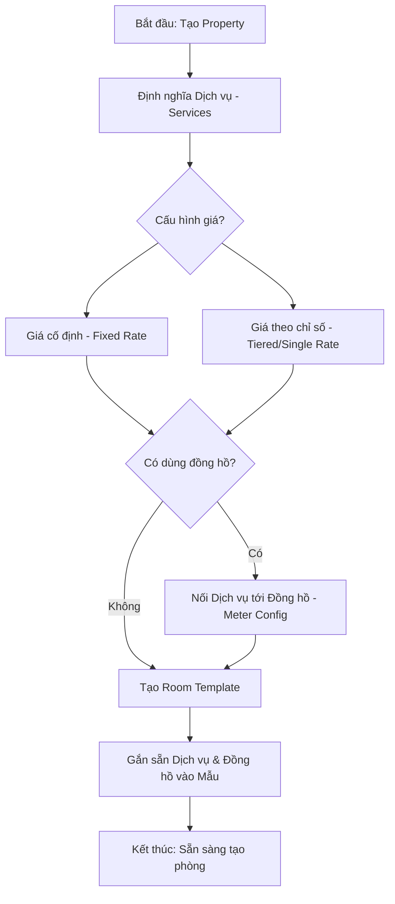
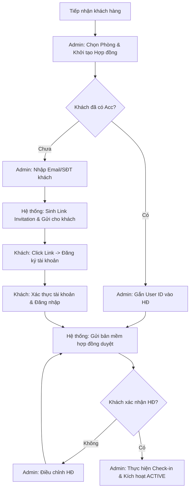
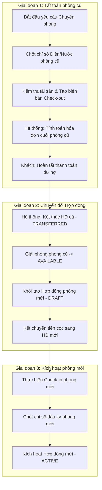
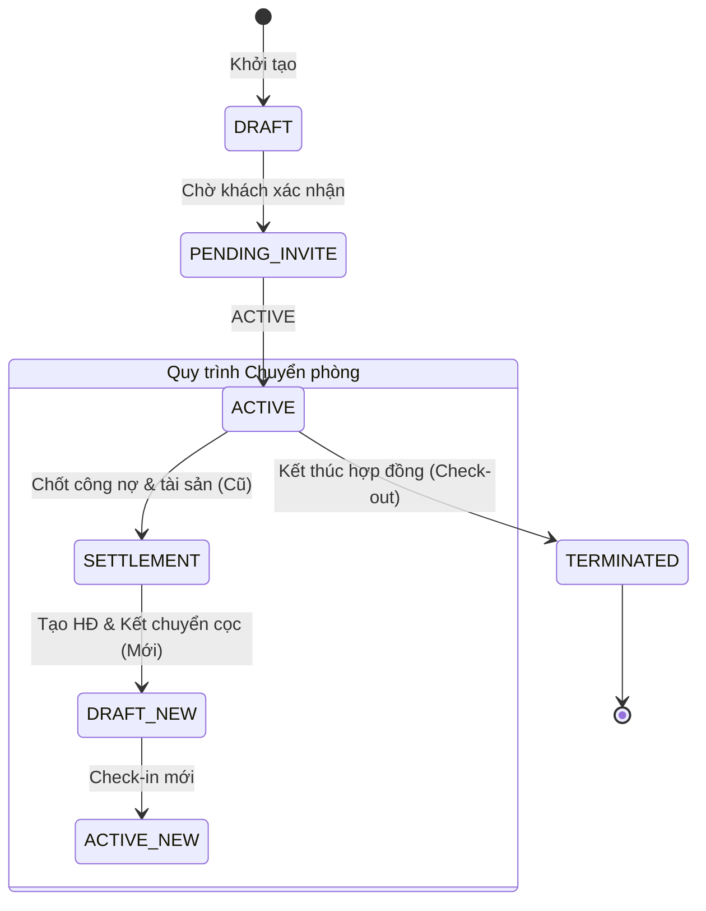

# Kế hoạch Tổng thể: Hệ thống Quản lý và Vận hành Hợp đồng Hostech

Bản kế hoạch này hợp nhất tất cả các nội dung đã được thảo luận và duyệt, bao gồm cả nội dung văn bản mẫu và sơ đồ quy trình nghiệp vụ.

---

## 1. Kế hoạch Nghiệp vụ Tổng thể (Operational Plan)

### 1.1. Giai đoạn: Cấu hình Property (Configuration)
- **Tạo Property**: Khởi tạo thông tin tòa nhà.
- **Tạo Dịch vụ**: Định nghĩa Service (Cố định hoặc Theo chỉ số).
- **Nối Dịch vụ tới Đồng hồ**: Map Service với Meter.
- **Room Template**: Thiết lập mẫu phòng chứa sẵn dịch vụ/đồng hồ.
- **Contract Template**: Cấu hình mẫu hợp đồng định dạng Markdown/PDF.

### 1.2. Giai đoạn: Vận hành Property (Operation)
- **Tạo Tầng/Phòng**: Triển khai thực tế từ Room Template.
- **Phân quyền Nhân sự**: Gán Manager/Staff theo Property Scope.
- **Quản lý Tenant & HĐ**: Tạo khách thuê, mời khách xác nhận hợp đồng.
- **Chu kỳ Tài chính**:
    - Chốt số điện nước định kỳ.
    - Tự động/Thủ công tạo Hóa đơn (Invoice).
    - Thanh toán & Đối soát nợ.
- **Sự kiện Vòng đời**: Bàn giao (Handover), Chấm dứt, Làm mới, Chuyển phòng.

---

## 2. Hệ thống Sơ đồ Workflow Trực quan (Diagrams)

### 2.1. Quy trình Cấu hình (Configuration Setup)

### 2.2. Quy trình Mời Người dùng (Invitation Flow)

### 2.3. Quy trình Chuyển phòng (Room Transfer Flow)

---

## 3. Vòng đời Trạng thái Hợp đồng (State Diagram)

---

## 4. Bảng giải thích Nghiệp vụ Chi tiết

| Mục | Nội dung Logic | Ghi chú |
| :--- | :--- | :--- |
| **Invitation** | Link mời có token, dẫn khách tới Register. Khách phải bấm "Xác nhận" HĐ sau khi login. | Đảm bảo tính pháp lý. |
| **Transfer** | Hợp đồng cũ (TRANSFERRED) -> Hợp đồng mới (DRAFT/ACTIVE). | Bảo toàn lịch sử check-in/out riêng cho từng phòng. |
| **Mapping** | `{{tags}}` trong Markdown được ánh xạ tự động từ `ContractService`. | Dữ liệu chính xác 100% từ DB. |
| **Cấu hình Meter** | Cho phép gán đồng hồ cho cả Fixed Rate. | Tăng tính linh hoạt nếu muốn theo dõi chỉ số. |

---

> [!NOTE]
> Tôi đã hợp nhất toàn bộ các đề xuất từ trước đến nay vào bản kế hoạch này. Không có nội dung nào bị xóa bỏ, chỉ được sắp xếp lại để khoa học và dễ theo dõi hơn.
