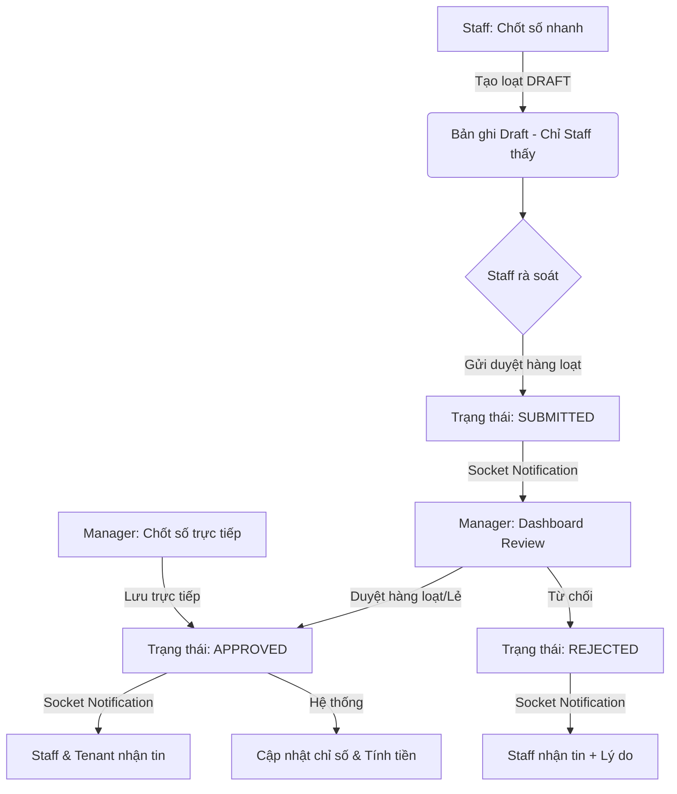

# Kế hoạch Triển khai Tính năng Quản lý Chốt Số và Hệ thống Socket (Bản chính thức)

Bản kế hoạch này điều chỉnh toàn bộ quy trình chốt số, tối ưu hóa quyền hiển thị dữ liệu và thiết lập nền tảng Socket thông báo chuyên sâu cho từng đối tượng.

## 1. Sơ đồ Luồng Công việc (Workflow)

## 2. Các điểm nội bật cần xử lý (Highlights)

> [!IMPORTANT]
> **Quyền hiển thị (Visibility):**
> *   **DRAFT:** Tuyệt đối ẩn với Manager. Chỉ Staff (người tạo) mới thấy để rà soát.
> *   **SUBMITTED:** Manager bắt đầu tiếp quản và xử lý.

> [!TIP]
> **Thao tác Hàng loạt (Bulk Actions):**
> *   **Staff:** Có nút "Gửi duyệt hàng loạt" sau khi chốt nhanh.
> *   **Manager:** Có giao diện "Duyệt nhanh" tập trung, tích chọn hàng loạt chỉ số chờ duyệt.

> [!WARNING]
> **Hạ tầng Socket cho Tenant:**
> *   Phát tín hiệu vào kênh `PrivateChannel('user.{tenant_id}')`. Đây là bước chuẩn bị hạ tầng lõi để App Tenant có thể tích hợp nhận thông báo tức thì trong tương lai.

## 3. Kết quả Kiểm tra Hiện trạng (Audit)
*   **Frontend (`QuickReadingPage.tsx`):** Payload gửi lên không kèm theo trường `status`.
*   **Backend (`MeterReadingService.php`):** Logic mặc định `$status = $data['status'] ?? 'DRAFT'`.
*   **Kết luận:** Hiện tại, tính năng chốt số nhanh tạo bản ghi ở dạng **`DRAFT`** (Bản nháp). Đúng như yêu cầu, chúng ta sẽ giữ nguyên logic này để Staff có bước rà soát trước khi gửi duyệt.

## 4. Danh sách các thay đổi kỹ thuật

### [Backend]
#### [MODIFY] [MeterReadingService.php](file:///c:/laragon/www/laravel/HostechBackEnd/backend/app/Services/Meter/MeterReadingService.php)
*   Cập nhật filter trong hàm `paginate()` để thực thi rule ẩn Draft (Chỉ chủ sở hữu mới thấy Draft).
*   Đảm bảo logic `syncMeterBaseReading()` chỉ chạy khi `status == 'APPROVED'`.

#### [MODIFY] [MeterReadingStatusChanged.php](file:///c:/laragon/www/laravel/HostechBackEnd/backend/app/Events/Meter/MeterReadingStatusChanged.php)
*   Tùy biến `broadcastOn()` để linh hoạt chọn Channel mục tiêu.

### [Frontend]
#### [NEW] [ManagerMeterReadingPage.tsx](file:///c:/laragon/www/laravel/HostechBackEnd/frontendV2Hostech/src/PropertyScope/features/metering/pages/ManagerMeterReadingPage.tsx)
*   Xây dựng UI Review dành riêng cho Manager.
#### [MODIFY] [MeterListPage.tsx] (Hoặc Component tương ứng)
*   Thêm tích năng chọn nhiều (Multi-select) và nút **"Gửi duyệt hàng loạt"** dành cho Staff.

---

## Kế hoạch kiểm thử (Verification)
1. Staff chốt số nhanh -> Manager không thấy -> Staff nhấn "Gửi duyệt hàng loạt" -> Manager nhận Socket và thấy dữ liệu.
2. Manager duyệt hàng loạt -> Staff nhận thông báo và chỉ số đồng hồ gốc được cập nhật.
ivateChannel('user.' . $id)` có sẵn trong Laravel. Tenant khi đăng nhập vào App trong tương lai chỉ cần lắng nghe kênh cá nhân của mình để nhận các cập nhật trạng thái chốt số trong thời gian thực. Theo cách này, Backend sẽ "đi trước một bước" so với Frontend của Tenant.

## Kế hoạch kiểm thử
1. Dùng tài khoản Staff chốt số -> Manager không được thấy bản Draft đó.
2. Staff nhấn Gửi duyệt -> Manager nhận thông báo Socket và thấy bản ghi hiện lên trang Review.
3. Manager duyệt hàng loạt -> Staff nhận thông báo và chỉ số đồng hồ được cập nhật.
" và "Nhập Số Mới (Auto-Approve)".
#### [MODIFY] [AppRouter/Route configuration]
* Đăng ký Page mới vào thanh Navigation nhưng được bọc (Wrap) bởi Role Guard (chỉ cho phép user_type = Manager truy cập).
#### [MODIFY] [metering.ts] (API Client)
* Cập nhật và tinh chỉnh tham số `status` cho phép gửi `APPROVED` khi bulk create.

---

> [!IMPORTANT]
> **Câu hỏi chờ xác nhận (Mời bạn trả lời để tôi tiến hành Code):**
> Về phần Socket cho Tenant: Hệ thống hiện tại đã hỗ trợ Socket/App cho phía Tenant nhận chưa, hay chúng ta chỉ cần phát luồng (Broadcast) ra Kênh `user.{tenant_id}` ở Backend để App điện thoại tự hứng (nếu có)?
